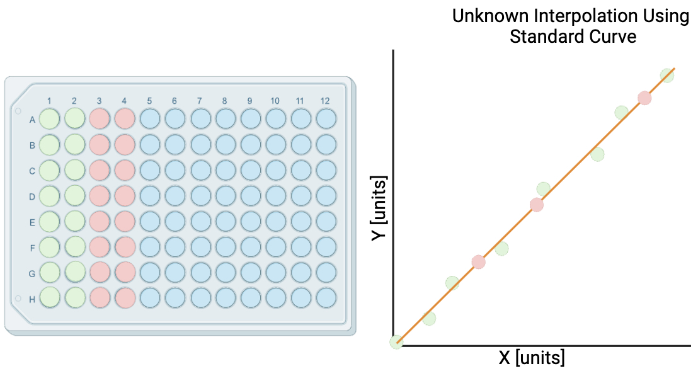
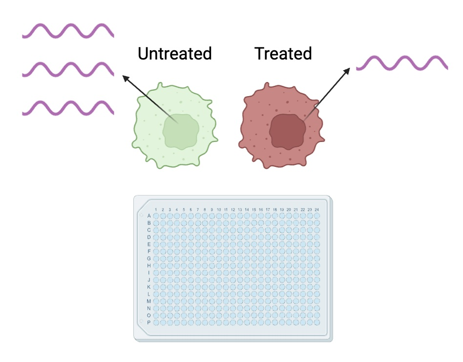
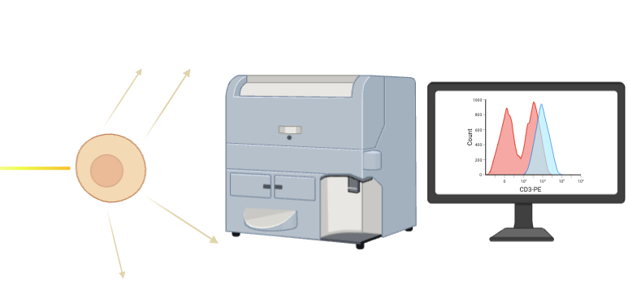

# Automation Tools for Routine Biotech Experiments

## Purpose

The goal in developing this web-application was to improve my personal skillset with foundational web developement tools, i.e Javascript, HTML CSS as well as 
create a series of tools that would improve my team and I's research laboratory workflow.

## Table of Contents
1. [Modules](#modules)
   * [96-well Standard Curve Assays](#96-well-standard-curve-assays)
   * [Relative Gene Expression](#relative-gene-expression)
   * [Flow Cytometry](#flow-cytometry)
2. [Technologies Used](#technologies-used)
4. [Contact Info](#contact-info)

## Modules
### 96-well Standard Curve Assays

This module automates the calculations neccessary to interpolate the concentration of samples called *unknowns* from a series of known concentration samples called *standards* and provides the user with the data as an excel file. Depending on the biophysical properties of the assay performed, certain regression models will work best at being able to fit a line through all the standards accurately. A metric that is commonly used to determine how accurate the regression model fits the standards is called the 
*coefficient of determination*, denoted as R2. The closer the value of R2 is to 1 the better the fit of the regression model and the more accurate the interpolated concentrations of the unknowns.

Below is a list of 96-well assays and which regression model option offered on the web application is typically used for them: 
* qPCR absolute quantification -> Logarithmic Regression
* [BCA Assay](https://documents.thermofisher.com/TFS-Assets/LSG/manuals/MAN0011430_Pierce_BCA_Protein_Asy_UG.pdf) & [Bradford Assay](https://www.bio-rad.com/webroot/web/pdf/lsr/literature/LIT33.pdf) -> Linear Regression
* [ELISA Assay](https://www.thermofisher.com/us/en/home/life-science/protein-biology/protein-biology-learning-center/protein-biology-resource-library/pierce-protein-methods/overview-elisa/elisa-data-analysis.html) -> 4-Parameter or 5-Parameter Logistic Regression

If the user is loading a gel for performing SDS-PAGE or Native-Gel electrophoresis, there is a toggable button that creates an interactive table for finding the right amount of total protein to load for each unknown.

Currently the module expects as input the raw data from the SoftMaxPro software.

### Relative Gene Expression

Relative gene expression is a method of analysis used to compare the expression of a gene relative to another sample. This relative comparison can be done in singleplex or multiplex assays and using [dye-based or probe-based](https://www.thermofisher.com/us/en/home/life-science/pcr/real-time-pcr/real-time-pcr-learning-center/real-time-pcr-basics/taqman-vs-sybr-chemistry-real-time-pcr.html) qPCR. The sample is first compared internally, quantifying the expression of a *gene of interest* to a gene with consitent expression called a *housekeeping gene*. Then the sample is compared externally to a sample that has not had any treatments or alterations done to it, referred to as the *reference sample*. The module provides the user with a 384-well diagram of their plate layout as well as an interactive table to select the housekeeping gene, gene of interest and the reference sample. Calculations are performed according to this [resource](https://horizondiscovery.com/-/media/Files/Horizon/resources/Technical-Manuals/delta-cq-solaris-technote.pdf).

Currently the module expects as input the results from a QuantStudio qPCR device.

### Flow Cytometry

Flow cytometry is a method of analysis in which cells are passed through a laser one-by-one and are then analyzed by their ability to alter the light based on their shape, size, or any fluorescent expression. Anytime the laser detects what it percieves to be a cell it is referred to as an *event*. This module accepts [.fcs](https://en.wikipedia.org/wiki/Flow_Cytometry_Standard) files and then creates 2-dimensional scatter plots allowing the user to create gates around the events of interest. A caveat of the module is its current inability to depict data in 3-dimensions as a heatmap, however that will be rectified in future updates.

## Technologies Used
* chart.js -> For creating plots
* fcs -> For parsing fcs files
* papaparse -> For parsing delimited files
* simple-statistics -> For statistical calculations
* sheetJs -> For creating excel files
* ml-levenberg-marquardt -> For optimizing the parameters of a 4PL and 5PL regression model
* esbuild -> For bundling dependencies

## Contact Info
Feel free to reach out for any reason using this [link](https://sosaaelie.github.io/PersonalR-DTools/contactform.html) also present on the bottom of the web application. Thank you checking out my project!

